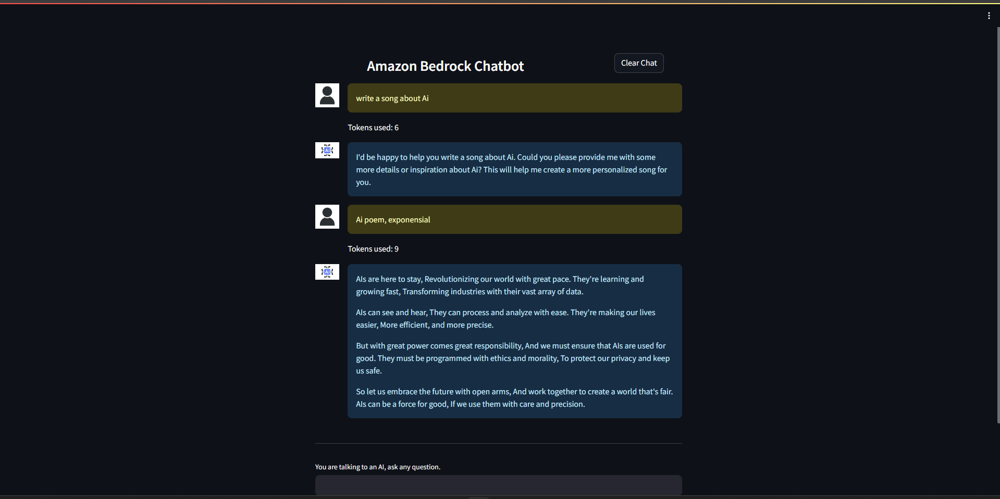

**Project Name**
## A chatbot application built using Amazon Web Services (AWS)

**Description**

This project deploys a chatbot application on AWS. The chatbot is powered by Amazon Bedrock, a service that  allows you to build natural language understanding and generation applications. The application is  deployed on an EC2 instance and is behind an Elastic Load Balancer for scalability. IAM is used to control access to the AWS resources.

**System design**

**Snapshots of webApp **

**Prerequisites**

* An AWS account
* Familiarity with AWS services, including EC2, IAM, and Elastic Load Balancers
* Some knowledge of Amazon Bedrock

**Getting Started**

1. Clone the repository
2. Create an AWS account and IAM role with the necessary permissions
3. Configure the AWS resources according to the instructions in the deployment guide
4. Deploy the application
5. Test the chatbot

**Deployment**

The deployment process involves creating and configuring several AWS resources.

1. Setup your AWS account and AWS bedrock model accesses.
2. create EC2 instance
  ON EC2 instance,
  4. install pip\n
     sudo yum install python3 python3-devel python3-pip
  5. install git\n
     sudo yum install git 
  6. Clone repo\n
     git clone git@github.com:RohanL1/chatbot.git
  7. install required python packages\n
     sudo pip install -r requirements.txt
  8. congfigure your EC2 instance to accept http connections.
9. create more Ec2 instances if required and perform step 2-7 for each.
10. create a load balancer and add these Ec2 instances as target group.
11. run server
   sudo streamlit run app.py --server.port 80
12. Chat with Your New Chatbot!

**Testing**

Once the application is deployed, you can test the chatbot by interacting with it through a chat interface. The specific way to interact with the chatbot will depend on the implementation.

**Contributing**

We welcome contributions to this project. 

**Authors**

* Rohan Lagare
